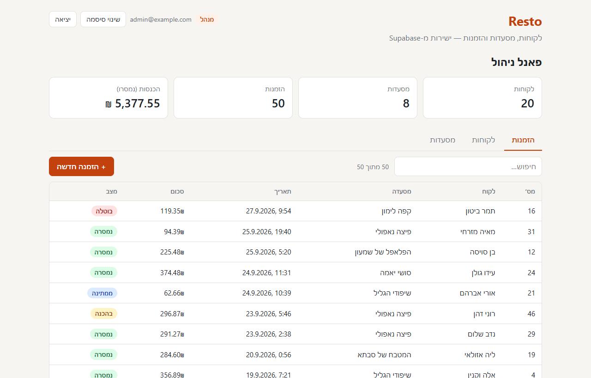
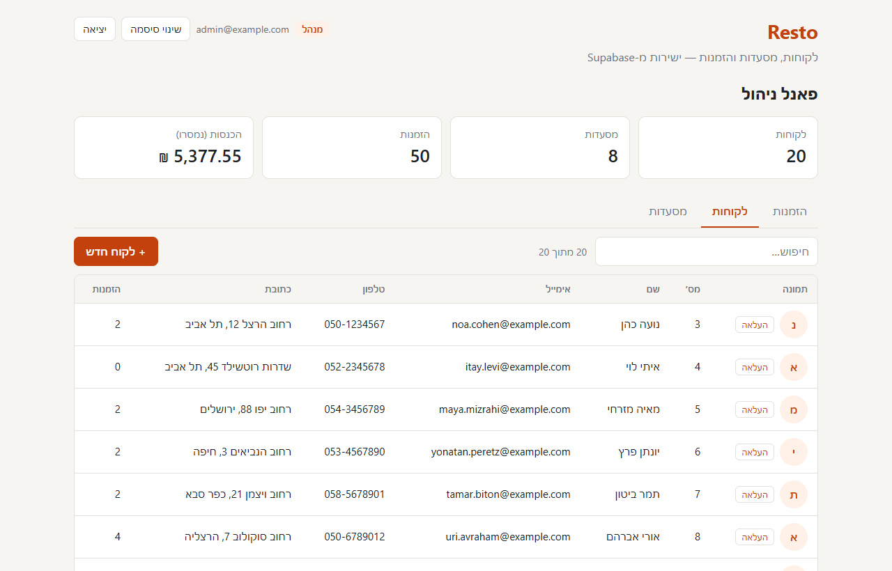
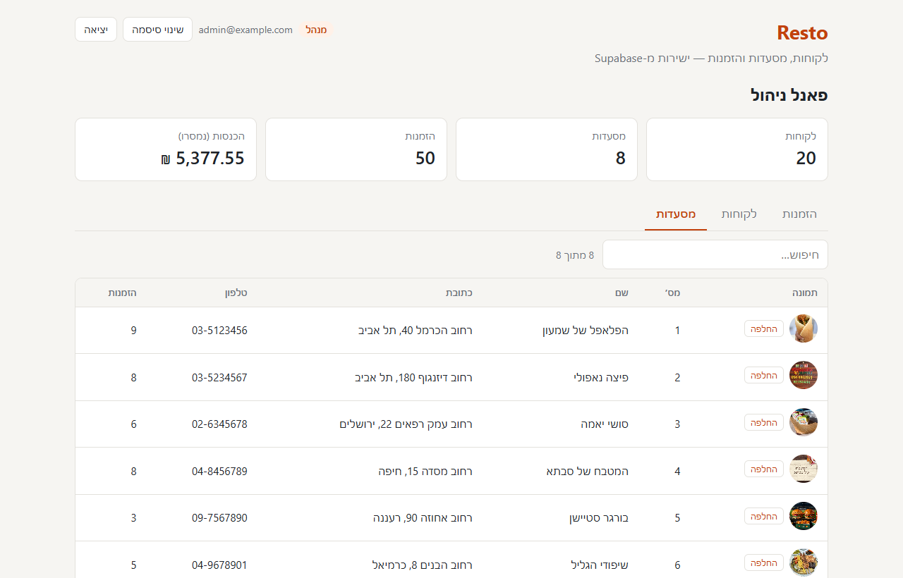
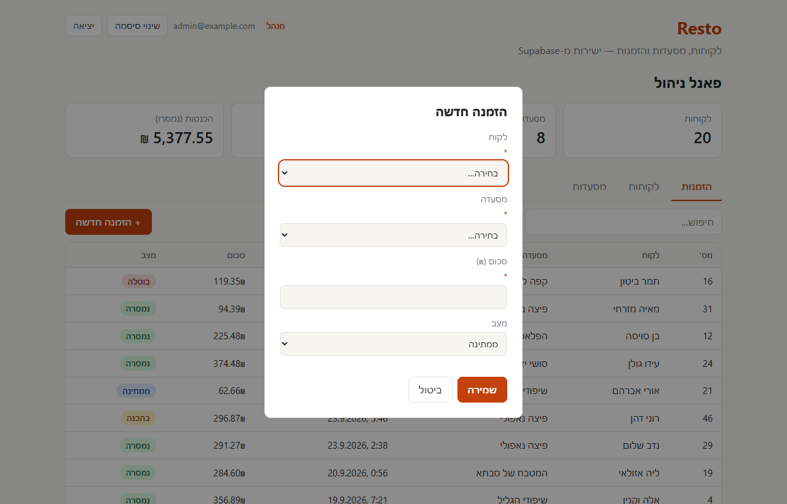
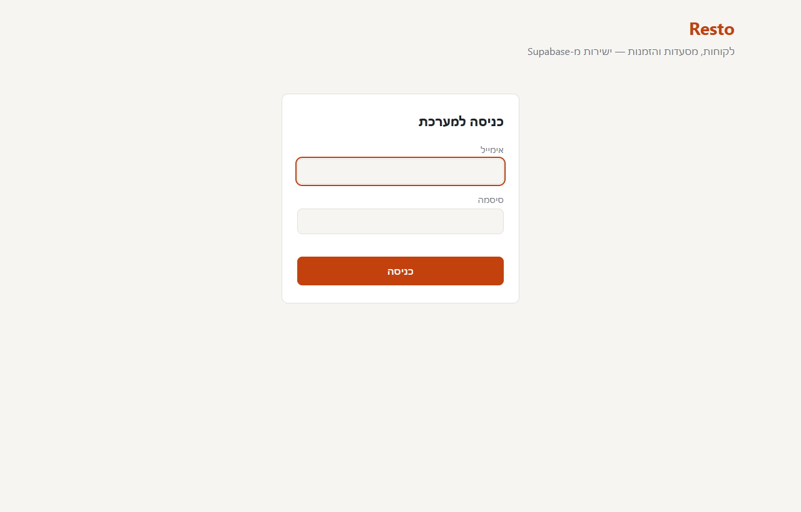
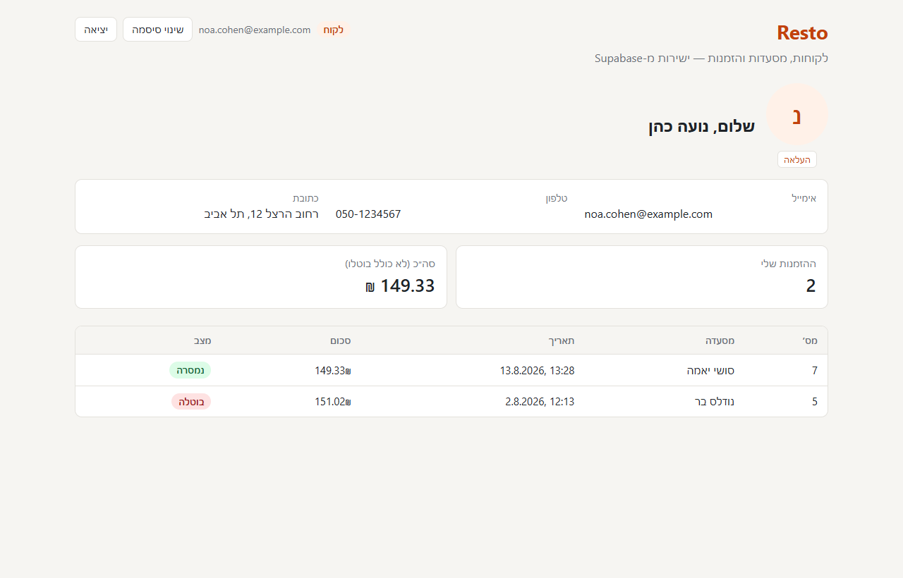

# Resto

מערכת לניהול לקוחות, מסעדות והזמנות, בנויה על [Supabase](https://supabase.com) עם ממשק HTML/CSS/JavaScript פשוט, בלי build.



## צילומי מסך

### פאנל ניהול (מנהל)

| לקוחות | מסעדות |
|---|---|
|  |  |

| הזמנה חדשה | מסך הכניסה |
|---|---|
|  |  |

### מסך לקוח

הלקוחה נועה כהן רואה רק את הפרטים ואת שתי ההזמנות שלה:



## מה יש במערכת

- **פאנל ניהול** (למנהל): סיכומים, טבלאות של כל ההזמנות, הלקוחות והמסעדות, חיפוש, הוספת לקוחות והזמנות, והעלאת תמונות.
- **מסך לקוח**: כל לקוח רואה רק את הפרטים וההזמנות שלו, ויכול להעלות תמונת פרופיל.
- **התחברות** עם אימייל וסיסמה (Supabase Auth), כולל שינוי סיסמה.
- **תמונות** ב-Supabase Storage: תמונות לקוחות פרטיות (קישור זמני), תמונות מסעדות ציבוריות.

## אבטחה

כל ההרשאות נאכפות במסד הנתונים באמצעות Row Level Security, לא בדפדפן:

| | לקוחות | הזמנות | מסעדות | הוספה | תמונות |
|---|---|---|---|---|---|
| מנהל | כולם | כולן | כולן | לקוחות והזמנות | כל התמונות |
| לקוח | רק עצמו | רק שלו | כולן | — | רק התמונה שלו |
| לא מחובר | — | — | — | — | תמונות מסעדות בלבד |

- התפקיד נשמר ב-`app_metadata`, שרק השרת יכול לשנות.
- לקוח מקושר למשתמש דרך `customers.user_id`.
- אין עדכון או מחיקה של רשומות מהממשק, מלבד החלפת תמונה.
- המפתח שב-`frontend/app.js` הוא ה-publishable key, שמיועד לדפדפן.

## מבנה

```
frontend/            הממשק: index.html, style.css, app.js
supabase/migrations/ כל שינויי מבנה מסד הנתונים וההרשאות, לפי הסדר
supabase/seed.sql    נתונים סינטטיים (20 לקוחות, 8 מסעדות, 50 הזמנות)
supabase/config.toml הגדרות הפרויקט
```

## הרצה

1. פותחים את `frontend/index.html` בדפדפן.
2. מתחברים עם משתמש קיים. משתמשים נוצרים על ידי מנהל בלוח הבקרה של Supabase (אין הרשמה עצמית).

### הקמה על פרויקט Supabase חדש

```bash
supabase link --project-ref <project-ref>
supabase db push          # יוצר טבלאות, הרשאות ו-Storage
supabase db query --linked -f supabase/seed.sql   # נתונים סינטטיים
```

אחר כך מעדכנים את `SUPABASE_URL` ו-`SUPABASE_KEY` ב-`frontend/app.js`.

למנהל: יוצרים משתמש ומגדירים לו `app_metadata = {"role": "admin"}`.
ללקוח: יוצרים משתמש ומעדכנים את `customers.user_id` ברשומה שלו.

> כל הנתונים במאגר סינטטיים. כתובות האימייל משתמשות בדומיין השמור `example.com`.
